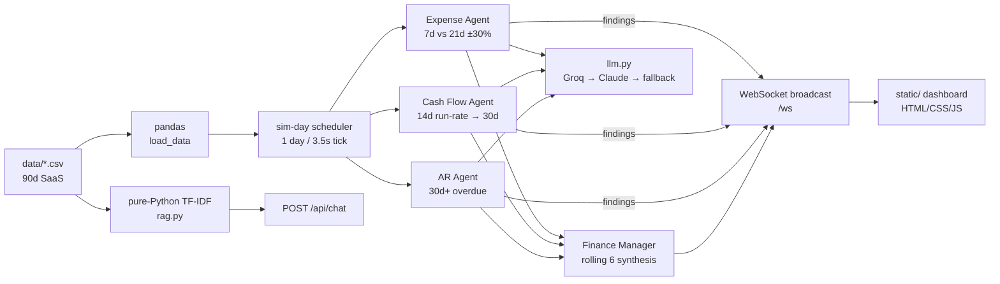

# FinPilot Live — Your Finance Team That Never Stops Watching

> Autonomous multi-agent finance department. No prompts. No polling. Agents notice things and speak up on their own — live on a WebSocket dashboard.
> Built for the **Agents, Everywhere** hackathon.


## Why FinPilot?

CFO dashboards wait for you to ask. FinPilot flips it:

1. Open `http://localhost:8000` — agents are already ticking.
2. Within seconds **AR Agent** flags `ABC Corp ₹8,00,000 / 47d overdue`.
3. Within ~20s **Expense Agent** flags `Cloud Infra +100%`.
4. **Finance Manager** synthesises the story unprompted.
5. Click **What should I do?** → ranked actions + before/after 30d cash.
6. Ask **“Why is profit down?”** in Ask Finance → grounded answer with sources.

> *“Nobody asked FinPilot anything. It’s a finance team that never stops watching, and this is what it noticed on its own.”*

## Features

- **Proactive agents:** Expense, Cash-Flow, AR specialists + Finance Manager synthesis. Push the moment findings are produced.
- **Deterministic detection, LLM narration only:** pandas thresholds decide; Claude/Groq only rephrase pre-computed numbers. Never invents figures.
- **Live transport:** FastAPI WebSocket broadcast + `hello` snapshot + 10-event replay for late joiners. Metrics every tick.
- **Ask Finance (RAG):** `POST /api/chat` — pure-Python TF-IDF retrieval over CSV-built corpus, no vector DB. Claude answers using only retrieved records, extractive fallback offline.
- **Scenario engine:** `POST /api/what-should-i-do` — deterministic before/after cash math (70% AR collection + cloud rollback + 3% freeze).
- **Human-in-the-loop:** large/unusual items `flagged for review`, never labelled fraud. Accusatory words stripped with fallback.
- **Offline-safe:** works with zero API keys via template fallbacks.

## Architecture



**Request flow:** `tick → asyncio.gather(3 agents in threads) → dedup → broadcast finding → broadcast metrics+tick → conditional synthesis → UI prepends card`.

## Tech Stack

| Layer | Choice |
|---|---|
| Backend | Python, FastAPI, Uvicorn, `asyncio` |
| Analysis | Pandas (thresholds, runway, P&L) |
| Realtime | Native WebSockets (`/ws`), `fetch` for actions |
| Frontend | Vanilla HTML/CSS/JS, no bundler — `Inter + JetBrains Mono`, neon terminal theme |
| LLM | Anthropic `claude-sonnet-4-5-20250929`, Groq `llama-3.3-70b-versatile` via OpenAI-compat `urllib`, template fallback |
| RAG | Hand-rolled tokenizer + IDF + synonym expansion, no LangChain/FAISS |
| Data | CSVs + `generate_data.py` (stdlib `csv/random`, seed 42) |
| Config | `python-dotenv`, `.env` (`TICK_SECONDS, START_DAY_IDX`) |

## Quickstart

```bash
pip install -r requirements.txt
python generate_data.py   # optional — CSVs already in data/
copy .env.example .env    # add ONE key: GROQ_API_KEY or ANTHROPIC_API_KEY
uvicorn app:app --port 8000
# open http://localhost:8000
```

No keys? Still works — narration falls back to deterministic templates.

## Configuration

| Var | Default | Meaning |
|---|---|---|
| `GROQ_API_KEY` / `ANTHROPIC_API_KEY` | — | Groq tried first, Claude second |
| `GROQ_MODEL` | `llama-3.3-70b-versatile` | Any Groq chat model |
| `CLAUDE_MODEL` | `claude-sonnet-4-5-20250929` | Single model for all narration |
| `TICK_SECONDS` | `3.5` | Seconds per simulated day |
| `START_DAY_IDX` | `77` | 0-based start (day 78/90, so findings surface instantly) |

## How Detection Works

- **Expense:** `recent_7d vs baseline_21d_avg*7`. `>30% info, >50% warning, >80% critical`. Ignores `<Rs 12k` baselines. Scans `transactions.csv OUT` for `>=Rs 1L` singles.
- **Cash:** `cash = 25L + rev - exp`. `daily_net = 14d net / 14`. `proj_30/60`. Warn if `proj_30 < Rs 20L`.
- **AR:** `days_late = sim_date - due_date`. Flag `>=30d`. Critical if `>=45d & >=Rs 5L`. Ranked by `amount*days_late`.
- **Manager:** only `warning/critical` in rolling last-20, synthesises last-6.

## API Reference

`GET /api/state → {revenue,expenses,profit,cash,overdue_total,sim_date,sim_day,tick,active_alerts}`
`POST /api/what-should-i-do → {recommendations[{action,impact_estimate}], projected_cash_before, projected_cash_after}`
`POST /api/chat {"question":"..."} → {answer, sources[]}`
`WS /ws → {type:hello|metrics|finding|synthesis|tick|recommendations}`

Try: `Why is profit down? / Who owes us the most? / What is our cash position?`

## Project Structure

```
app.py             # FastAPI + scheduler + WS
agents.py          # deterministic specialists + manager + scenario
llm.py             # Groq → Claude → fallback narration
rag.py             # TF-IDF corpus + retrieve + answer
generate_data.py   # synthetic 90d story generator
data/              # expenses,revenue,transactions,invoices,budgets.csv
static/            # index.html, app.js (WS-only), styles.css
```

## Guardrails

- All money from CSVs or deterministic math.
- LLM cannot decide anomaly or invent numbers/dates/vendors.
- `fraud/fraudulent/scam/embezzlement/theft` stripped → fallback. UI shows `flagged for review`.


## License

MIT — hackathon prototype with synthetic data. No real customer data.
